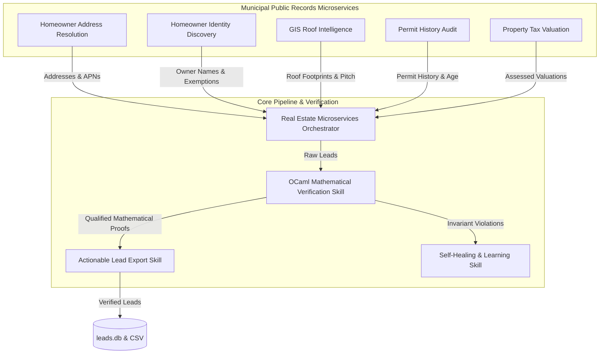

# Roo4u Agentic Skills Architecture

This catalog defines the discrete capabilities, interface contracts, and execution protocols governing the Roo4u autonomous lead generation fleet. All programmatic validations enforce strict mathematical invariants compiled via OCaml 5.5.0.

## Skills Directory

| Skill Name | Path | Domain | Description |
|---|---|---|---|
| **Property Discovery** | [`skills/discovery-agent/SKILL.md`](skills/discovery-agent/SKILL.md) | Web Scraping / Extraction | Autonomous navigation, DOM cleaning, and property candidate discovery in target zip codes. |
| **Municipal Assessor & Permit Enrichment** | [`skills/assessor-permit-enrichment/SKILL.md`](skills/assessor-permit-enrichment/SKILL.md) | Public Records / GIS | San Francisco PIM Assessor and DBI building/reroofing permit history extraction and APN resolution. |
| **Homeowner Identity Discovery** | [`skills/homeowner-discovery/SKILL.md`](skills/homeowner-discovery/SKILL.md) | Public Records / Ownership | Assessor Secured Roll & deed registry query for homeowner names, entity types, and homeowner tax exemptions. |
| **Homeowner Address Resolution** | [`skills/homeowner-address-resolution/SKILL.md`](skills/homeowner-address-resolution/SKILL.md) | Public Records / Addressing | Assessor Roll & Enterprise Addressing System (EAS) query for neighborhood addresses and residential zoning. |
| **GIS Roof Intelligence** | [`skills/gis-roof-intelligence/SKILL.md`](skills/gis-roof-intelligence/SKILL.md) | GIS / Spatial Intelligence | Municipal building footprints and green roofs spatial layers for roof area, pitch classification, and heights. |
| **Permit History & Roof Age Audit** | [`skills/permit-history-audit/SKILL.md`](skills/permit-history-audit/SKILL.md) | Public Records / Building Permits | Department of Building Inspection (DBI) permits audit for reroofing history and empirical roof age calculation. |
| **Property Tax Valuation** | [`skills/property-tax-valuation/SKILL.md`](skills/property-tax-valuation/SKILL.md) | Public Records / Tax Assessment | Assessor Secured Tax Roll query for land/improvement valuations, improvement-to-land ratios, and construction year. |
| **Real Estate Microservices Orchestrator** | [`skills/real-estate-microservices-orchestration/SKILL.md`](skills/real-estate-microservices-orchestration/SKILL.md) | Multi-Service Orchestration | Unified multi-source acquisition, correlation, algebraic invariant checking, and cryptographic proof generation. |
| **Mathematical Lead Verification** | [`skills/mathematical-qualification/SKILL.md`](skills/mathematical-qualification/SKILL.md) | Formal Verification / OCaml | Type-safe algebraic invariant checking and deterministic actionability scoring ($S \in [0.0, 100.0]$). |
| **Self-Healing Learning & Dual Memory** | [`skills/self-healing-learning/SKILL.md`](skills/self-healing-learning/SKILL.md) | Telemetry / Memory | Closed-loop error observation, dual-memory upsert (`lessons_learned.json` & vector store), and feedforward mitigation. |
| **Actionable Lead Export** | [`skills/lead-export-actionability/SKILL.md`](skills/lead-export-actionability/SKILL.md) | Data Persistence / CRM | Formal qualification filtering, cryptographic sign-off, and CSV/Database export for high-value contractor outreach. |

## Skill Coordination Topology

## Global Execution Invariants

1. **Zero-Cloud API Invariant**: All browsing, inference, and extraction execute on local loopback infrastructure or local models (`localhost:8000`).
2. **Mathematical Verification Invariant**: No lead transitions to `VALIDATED` or `QUALIFIED` without an affirmative mathematical certificate generated by the OCaml verification engine.
3. **Dual-Memory Synchronization Invariant**: Every observed scraping failure or selector drift event must be atomically persisted to `lessons_learned.json` and indexed in `memory/vector_store.sqlite`.
4. **Public Record Provenance Invariant**: Every acquired lead attribute must trace to an authoritative municipal open data endpoint (Assessor Roll, DBI Building Permits, or GIS Building Footprints).

