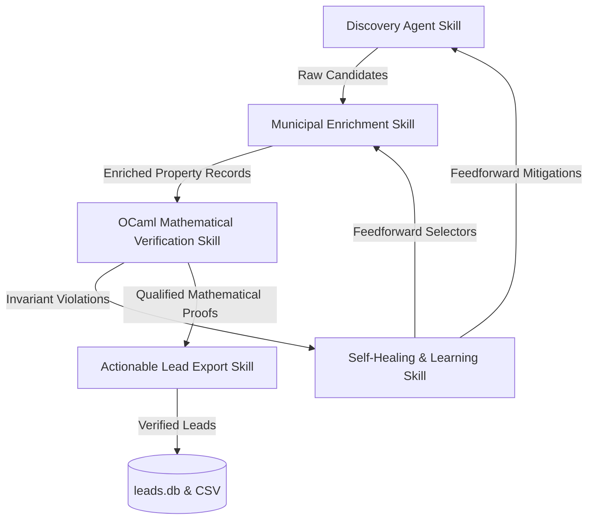

# Roo4u Agentic Skills Architecture

This catalog defines the discrete capabilities, interface contracts, and execution protocols governing the Roo4u autonomous lead generation fleet. All programmatic validations enforce strict mathematical invariants compiled via OCaml 5.5.0.

## Skills Directory

| Skill Name | Path | Domain | Description |
|---|---|---|---|
| **Property Discovery** | [`skills/discovery-agent/SKILL.md`](skills/discovery-agent/SKILL.md) | Web Scraping / Extraction | Autonomous navigation, DOM cleaning, and property candidate discovery in target zip codes. |
| **Municipal Assessor & Permit Enrichment** | [`skills/assessor-permit-enrichment/SKILL.md`](skills/assessor-permit-enrichment/SKILL.md) | Public Records / GIS | San Francisco PIM Assessor and DBI building/reroofing permit history extraction and APN resolution. |
| **Mathematical Lead Verification** | [`skills/mathematical-qualification/SKILL.md`](skills/mathematical-qualification/SKILL.md) | Formal Verification / OCaml | Type-safe algebraic invariant checking and deterministic actionability scoring ($S \in [0.0, 100.0]$). |
| **Self-Healing Learning & Dual Memory** | [`skills/self-healing-learning/SKILL.md`](skills/self-healing-learning/SKILL.md) | Telemetry / Memory | Closed-loop error observation, dual-memory upsert (`lessons_learned.json` & vector store), and feedforward mitigation. |
| **Actionable Lead Export** | [`skills/lead-export-actionability/SKILL.md`](skills/lead-export-actionability/SKILL.md) | Data Persistence / CRM | Formal qualification filtering, cryptographic sign-off, and CSV/Database export for high-value contractor outreach. |

## Skill Coordination Topology

## Global Execution Invariants

1. **Zero-Cloud API Invariant**: All browsing, inference, and extraction execute on local loopback infrastructure or local models (`localhost:8000`).
2. **Mathematical Verification Invariant**: No lead transitions to `VALIDATED` or `QUALIFIED` without an affirmative mathematical certificate generated by the OCaml verification engine.
3. **Dual-Memory Synchronization Invariant**: Every observed scraping failure or selector drift event must be atomically persisted to `lessons_learned.json` and indexed in `memory/vector_store.sqlite`.
