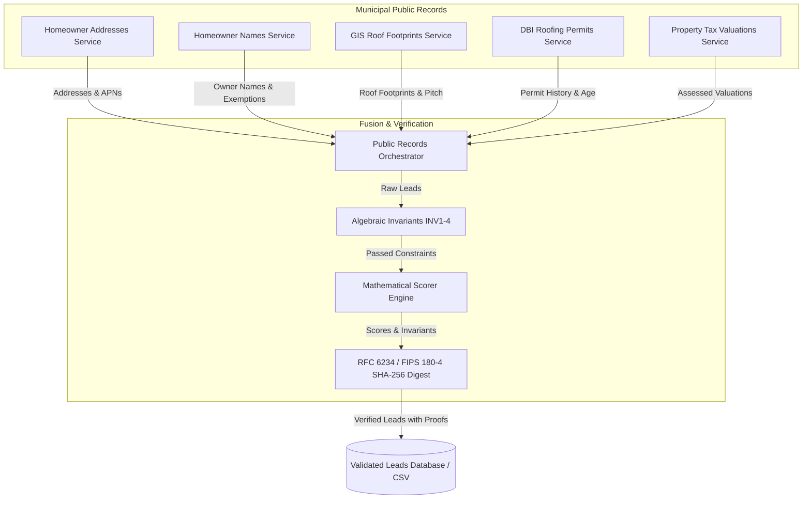

# Real Estate Microservices Orchestration Skill

## Purpose
This skill coordinates all 5 public records microservices:
1. **Homeowner Names Discovery** (Assessor Roll `wv5m-vpq2` & Deeds Index)
2. **Homeowner Addresses Resolution** (Assessor Roll & Enterprise Addressing System)
3. **GIS Roof Footprint Intelligence** (Building Footprints `sfnk-6tdn` & Planning PIM)
4. **Permit History & Roof Age Audit** (DBI Permits `i98e-djp9` & PTS)
5. **County Property & Tax Valuations** (Assessor Secured Tax Roll `wv5m-vpq2`)

It correlates data across APN parcel numbers and street addresses, constructs structured property candidates, executes type-safe algebraic invariant checks (`INV-1` to `INV-4`), calculates deterministic actionability scores ($S \in [0.0, 100.0]$), and emits cryptographic SHA-256 verification certificates.

## Orchestration Architecture



## OCaml Programmatic Interface

```ocaml
open Roof_engine
open Types

val Public_records_orchestrator.get_public_records_answers :
  unit -> public_records_answers

val Public_records_orchestrator.acquire_neighborhood_public_records :
  ?limit:int ->
  ?timeout:float ->
  neighborhood:string ->
  unit -> (verified_lead list, string) result
```

## CLI Execution

```bash
# Print source metadata for all 5 public record inquiries
roof_pipeline --public-records-sources

# Acquire and formally qualify leads in target neighborhood
roof_pipeline --acquire-public-records "Pacific Heights" --limit 10
```
